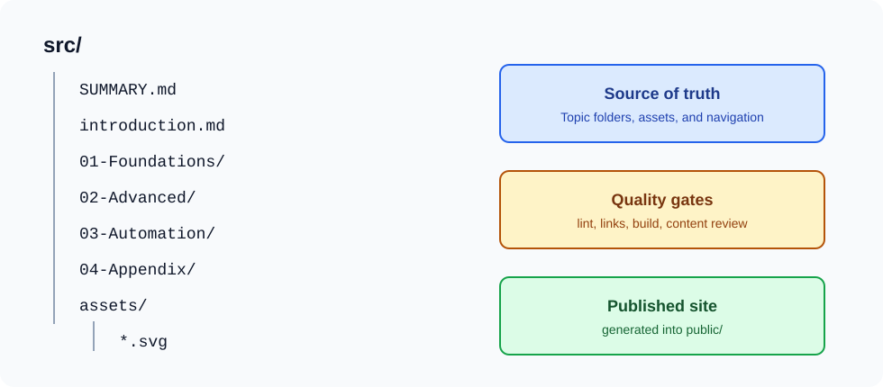

# Docs-as-Code Setup

Docs-as-Code means documentation is written, reviewed, versioned, tested, and released with the same workflow as source
code.

## Recommended Structure

Use topic folders so contributors can find the right maintenance area quickly.



```text
src/
├── SUMMARY.md
├── 01-Overview/
├── 02-Foundations/
├── 03-Advanced/
├── 04-Automation/
├── 05-Appendix/
└── assets/
```

## Naming Rules

Use lowercase kebab-case for file names:

```text
markdown-basics.md
release-checklists.md
api-authentication.md
```

Avoid spaces, uppercase surprises, and vague names such as `New Stuff.md` or `misc.md`.

## Documentation Types

| Type | Reader Question | Example |
| --- | --- | --- |
| Tutorial | How do I learn this by doing? | Build your first endpoint |
| How-to guide | How do I solve this specific task? | Rotate a database password |
| Explanation | Why does this work this way? | Authentication architecture |
| Reference | What are the exact details? | CLI command options |

Do not mix all four into one page. A tutorial that suddenly becomes an API reference will lose beginners.

## Ownership

Every important documentation area needs an owner. Ownership does not mean only one person may edit it. It means someone
is responsible for accuracy.

```text
src/02-Foundations/    owned by documentation maintainers
src/03-Advanced/       owned by technical specialists
src/04-Automation/     owned by platform or CI maintainers
src/05-Appendix/       owned by documentation maintainers
```

For GitHub repositories, use `CODEOWNERS` when the team is ready:

```text
/src/03-Advanced/ @org/architecture-team
/src/04-Automation/ @org/platform-team
```

## Definition of Done

A code change is not done when documentation is out of date:

- New feature includes usage documentation.
- Changed behavior updates existing docs.
- Breaking change includes migration notes.
- New operational risk includes troubleshooting guidance.
- Public API change includes examples.
