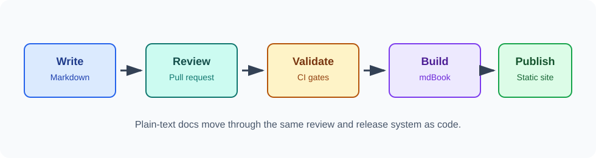

# mdBook Static Sites

mdBook turns Markdown files into a searchable static website. It is fast, simple, and Git-friendly.

## Minimal Project

```text
.
├── book.toml
└── src/
    ├── SUMMARY.md
    └── 01-Foundations/
        └── information-architecture.md
```

## `book.toml`

```toml
[book]
title = "Markdown Docs-as-Code Guide"
language = "en"
src = "src"

[build]
build-dir = "public"
create-missing = false

[output.html]
mathjax-support = true
additional-css = ["theme/custom.css"]
```

| Setting | Meaning |
| --- | --- |
| `src` | Folder containing Markdown source files. |
| `build-dir` | Output folder for the generated static site. |
| `create-missing` | Prevents accidental empty pages from being generated. |
| `mathjax-support` | Enables LaTeX-style math rendering. |
| `additional-css` | Adds custom styling without modifying mdBook internals. |

## Build and Serve

```powershell
mdbook build
```

```powershell
mdbook serve --open
```

## Assets

Store images and exported diagrams under `src/assets/`:

```text
src/assets/
├── docs-as-code-flow.svg
└── project-structure.svg
```

Link them from nested chapters with relative paths:

```markdown

```

## Plugin Policy

Plugins are powerful, but they add operational cost. Before adding one, decide:

- Is the feature essential?
- Is the plugin maintained?
- Can CI install the same version locally?
- Does it work on Windows, Linux, and macOS?
- What happens if the plugin breaks?
