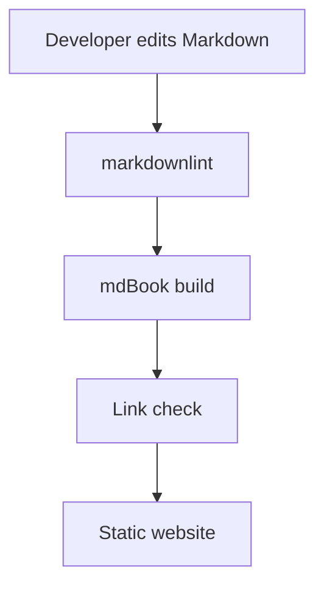
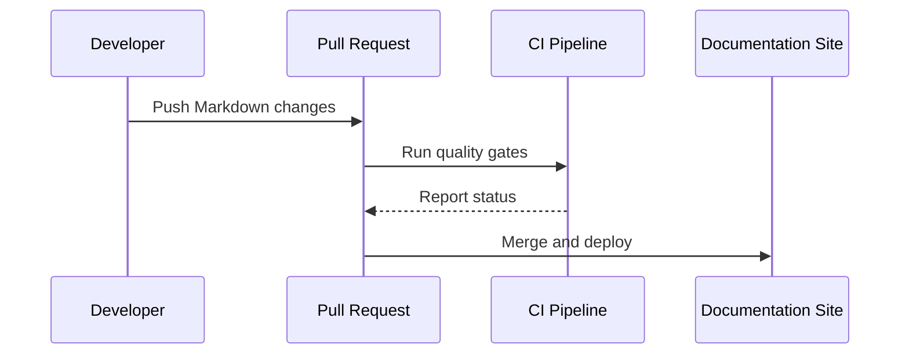
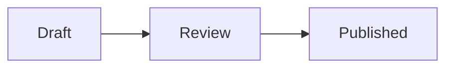
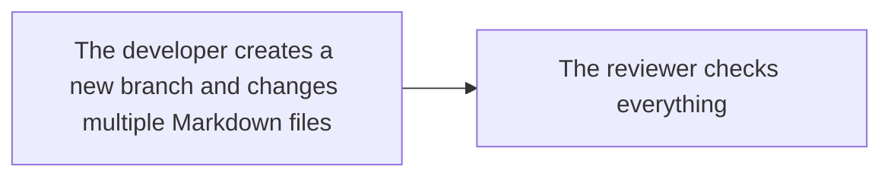

# Mermaid Diagrams

Mermaid lets you write diagrams as text. That makes diagrams reviewable in Git and easy to keep near the code they
explain.

## When to Use Mermaid

Use Mermaid for:

- Flowcharts.
- Sequence diagrams.
- State machines.
- Entity relationship diagrams.
- Git graphs.
- Simple architecture overviews.

Avoid Mermaid when you need pixel-perfect layouts, custom icons, or very large diagrams.

## Flowchart

````markdown

````

## Sequence Diagram



## Mermaid in GitHub and mdBook

GitHub renders Mermaid diagrams in Markdown files, issues, pull requests, and wikis. mdBook does not render Mermaid by
default.

| Option | Pros | Cons |
| --- | --- | --- |
| Keep Mermaid as code blocks | Zero setup, portable source | Website readers see source, not graphics |
| Add `mdbook-mermaid` | Rendered diagrams | Extra binary in local and CI setup |
| Export SVG or PNG assets | Works everywhere | Diagram source and image can drift |

For training documentation, start with code blocks and exported SVGs for important diagrams. Add a plugin only when the
team accepts the extra tool dependency.

## Style Tips

Good:



Hard to maintain:



Long labels make diagrams noisy. Put details in the surrounding text.
