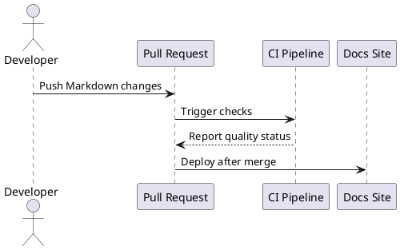

# PlantUML Diagrams 🌱

PlantUML is a text-based diagram tool with strong support for UML, C4-style architecture diagrams, sequence diagrams,
component diagrams, and deployment views.

## Mermaid vs PlantUML

| Need | Prefer |
| --- | --- |
| Lightweight diagrams inside GitHub Markdown | Mermaid |
| UML-heavy architecture documentation | PlantUML |
| C4 model diagrams | PlantUML |
| Simple flowcharts for onboarding | Mermaid |
| Large diagrams with includes and shared styles | PlantUML |

## Sequence Diagram



## C4-Style Thinking

| Level | Question |
| --- | --- |
| Context | Who uses the system and what external systems exist? |
| Container | What deployable parts make up the system? |
| Component | What major pieces exist inside a container? |
| Code | What classes, modules, or functions matter for this decision? |

Do not start with a class diagram when the reader first needs context.

## Repository Pattern

*Note: mdBook does not support PlantUML natively unless you install the `mdbook-plantuml` preprocessor,*
*which requires Java in your environment. Instead, it is highly recommended to export your PlantUML diagrams*
*as SVG files and embed those directly to avoid adding heavy dependencies.*

```text
src/assets/diagrams/
├── deployment.puml
├── request-flow.puml
└── system-context.puml
```

Then export stable images for renderers that do not support PlantUML directly.

## Keep Diagrams Maintainable

- Use one diagram per purpose.
- Name diagram files after the question they answer.
- Prefer SVG for crisp text on documentation sites.
- Commit the source file and the rendered asset when the site cannot render PlantUML itself.
- Review diagrams like code.
