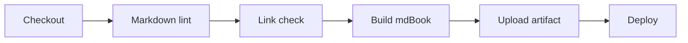

# CI Automation ⚙️

Automation keeps documentation honest. A pull request should not merge if the documentation site cannot build.

## Pipeline Stages



## GitHub Actions Example

```yaml
name: docs

on:
  pull_request:
  push:
    branches:
      - main

jobs:
  quality:
    runs-on: ubuntu-latest
    steps:
      - uses: actions/checkout@v4

      - uses: actions/setup-node@v4
        with:
          node-version: 24

      - name: Lint Markdown
        run: npx markdownlint-cli2 "**/*.md" "#public" "#node_modules"

      - name: Install mdbook-mermaid
        run: cargo install mdbook-mermaid --version 0.17.0 --locked

      - uses: peaceiris/actions-mdbook@v2
        with:
          mdbook-version: 0.5.3

      - name: Build mdBook
        run: mdbook build

      - name: Check Links
        uses: lycheeverse/lychee-action@v2
        with:
          args: --base public public/**/*.html
```

## What to Automate

| Check | Tool | Failure Means |
| --- | --- | --- |
| Markdown style | markdownlint | The source is inconsistent or malformed. |
| Build | mdBook | The website cannot be generated. |
| Links | Lychee or another link checker | Readers will hit broken navigation. |
| Spelling | cspell | The docs likely contain typos. |
| Diagrams | Mermaid CLI or PlantUML | Diagram source no longer renders. |

Start with lint, build, and links. Add spelling and diagram rendering when the basics are stable.
